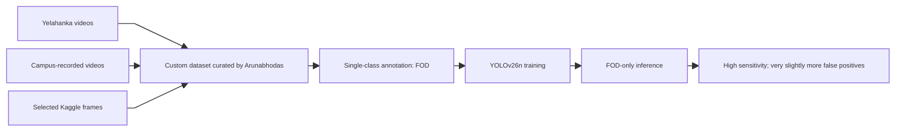
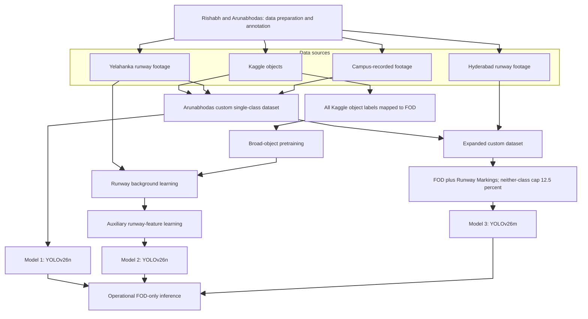
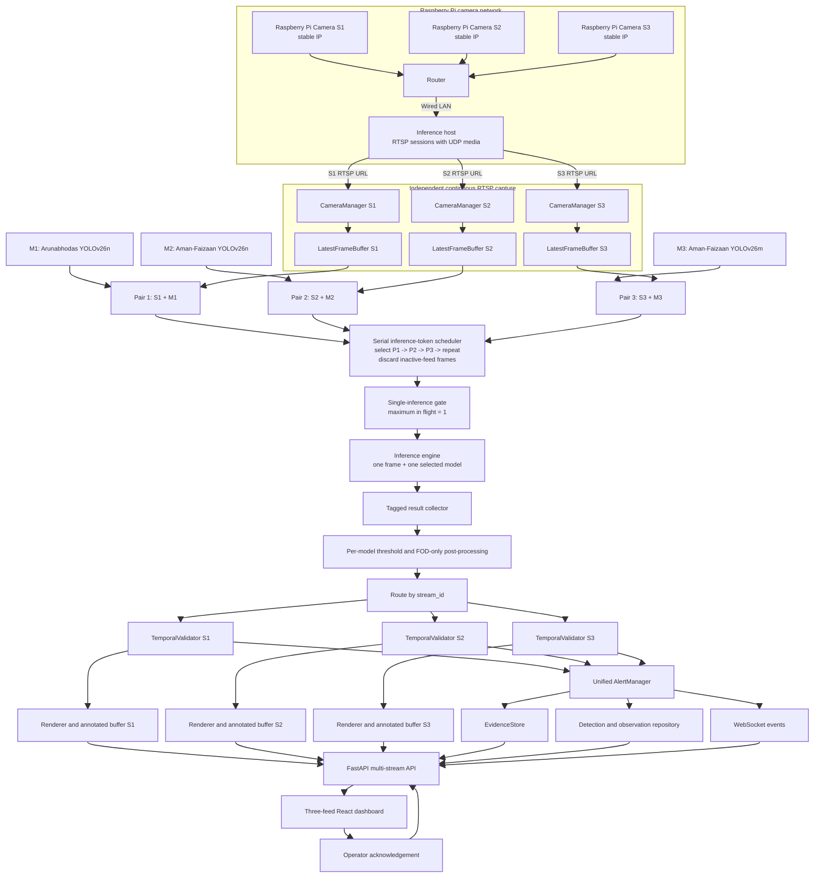
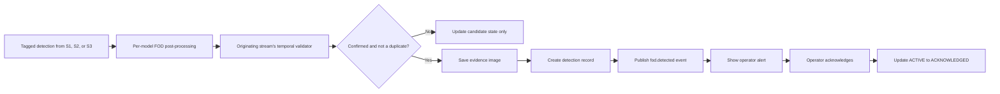
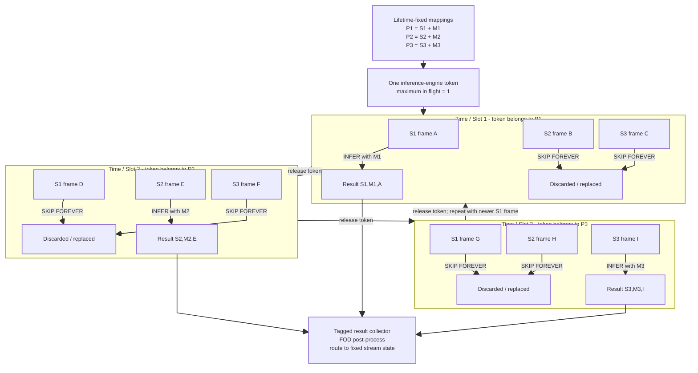
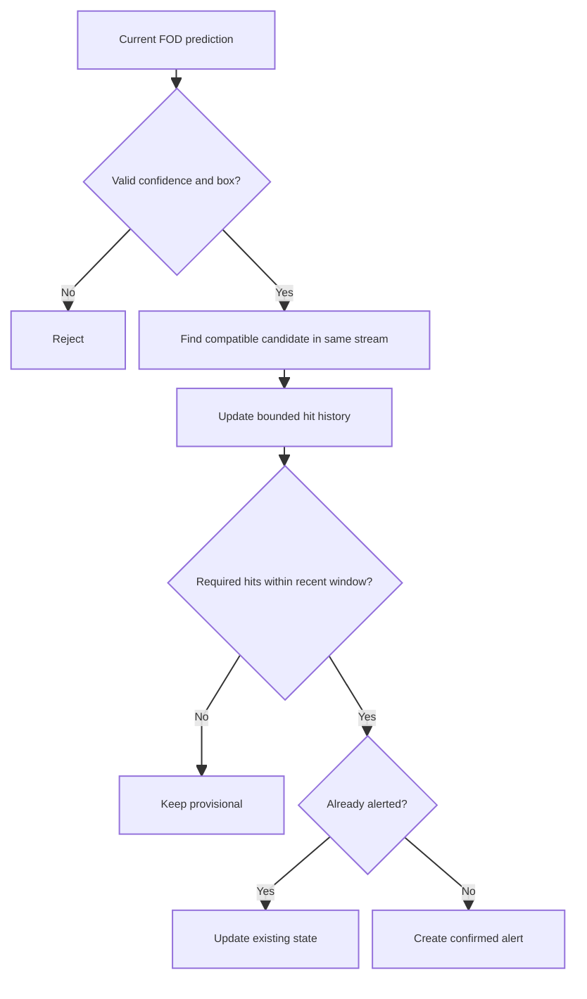
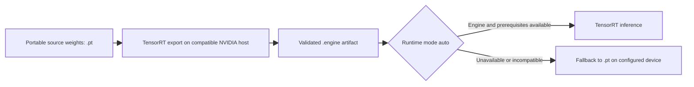
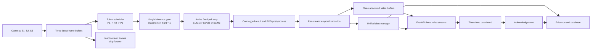

# Consolidated FOD Detection Framework

**Document type:** Architecture, model-training, and operating-framework overview  
**System purpose:** Real-time detection and operator alerting for Foreign Object Debris on airport runways  
**Current architecture:** Three lifetime-fixed camera-model pairs sharing one inference engine through round-robin access  
**Intended audience:** Readers with no prior knowledge of the project

<style>
.mermaid-chart {
  display: flex;
  justify-content: center;
  width: 100%;
  overflow: visible !important;
}

.mermaid-chart svg {
  width: auto !important;
  height: auto !important;
  max-width: 100% !important;
  max-height: 420px !important;
}

@media print {
  @page mermaid-landscape {
    size: A4 landscape;
    margin: 7mm;
  }

  .mermaid-chart {
    break-inside: avoid-page !important;
    page-break-inside: avoid !important;
  }

  .mermaid-chart svg {
    display: block !important;
    width: auto !important;
    height: auto !important;
    max-width: 100% !important;
    max-height: 170mm !important;
    margin: 0 auto !important;
  }

  .mermaid-chart--full-page {
    page: mermaid-landscape;
    break-before: page !important;
    break-after: page !important;
    page-break-before: always !important;
    page-break-after: always !important;
    width: 100% !important;
    height: 180mm !important;
    align-items: center;
  }

  .mermaid-chart--full-page svg {
    max-width: 270mm !important;
    max-height: 180mm !important;
  }
}
</style>

---

## Table of contents

1. [Executive summary](#1-executive-summary)
2. [Understanding the FOD problem](#2-understanding-the-fod-problem)
   1. [What is FOD](#21-what-is-fod)
   2. [Why automated FOD detection is difficult](#22-why-automated-fod-detection-is-difficult)
   3. [Project response to the problem](#23-project-response-to-the-problem)
3. [Project scope and current operating design](#3-project-scope-and-current-operating-design)
4. [People and responsibilities](#4-people-and-responsibilities)
5. [Dataset preparation and annotation](#5-dataset-preparation-and-annotation)
6. [Model portfolio](#6-model-portfolio)
   1. [Model 1 Arunabhodas YOLOv26n](#61-model-1-arunabhodas-yolov26n)
   2. [Model 2 Aman and Faizaan YOLOv26n](#62-model-2-aman-and-faizaan-yolov26n)
   3. [Model 3 Aman and Faizaan YOLOv26m](#63-model-3-aman-and-faizaan-yolov26m)
   4. [Model comparison](#64-model-comparison)
7. [Consolidated model-training flow](#7-consolidated-model-training-flow)
8. [End-to-end system architecture](#8-end-to-end-system-architecture)
   1. [Core design principles](#81-core-design-principles)
   2. [Component architecture](#82-component-architecture)
   3. [Raspberry Pi camera network and RTSP UDP ingestion](#83-raspberry-pi-camera-network-and-rtsp-udp-ingestion)
   4. [Runtime frame flow](#84-runtime-frame-flow)
   5. [Confirmed detection and alert flow](#85-confirmed-detection-and-alert-flow)
9. [Fixed camera-model pairs with round-robin inference-engine access](#9-fixed-camera-model-pairs-with-round-robin-inference-engine-access)
   1. [Scheduling policy](#91-scheduling-policy)
   2. [Round-robin sequence](#92-round-robin-sequence)
   3. [Why latency remains low](#93-why-latency-remains-low)
   4. [Result handling](#94-result-handling)
10. [Detection confirmation and false-positive control](#10-detection-confirmation-and-false-positive-control)
11. [Backend services and data storage](#11-backend-services-and-data-storage)
12. [Operator dashboard and communication](#12-operator-dashboard-and-communication)
13. [Deployment and model runtime](#13-deployment-and-model-runtime)
14. [Configuration](#14-configuration)
15. [Reliability concurrency and monitoring](#15-reliability-concurrency-and-monitoring)
16. [Testing and validation](#16-testing-and-validation)
17. [Known trade-offs and interpretation guidance](#17-known-trade-offs-and-interpretation-guidance)
18. [Recommended evaluation framework](#18-recommended-evaluation-framework)
19. [Conclusion](#19-conclusion)
20. [Glossary](#20-glossary)

---

## 1 Executive summary

Foreign Object Debris, or FOD, includes objects or loose material on an airfield that can damage aircraft, injure personnel, or interfere with safe operations. This project addresses the problem with a real-time computer-vision system that captures runway video, applies YOLO-based object-detection models, validates detections over time, displays annotated video, raises alerts, and stores evidence for later review.

The work produced three complementary models. Arunabhodas trained a compact YOLOv26n model on a single-class custom dataset. Aman and Faizaan jointly trained a second YOLOv26n through progressive exposure to a generalized Kaggle object dataset and increasingly detailed Yelahanka runway annotations. They also jointly trained a larger YOLOv26m using a custom dataset curated by Arunabhodas, extended with Hyderabad data and an explicit `Runway Markings` class. Rishabh and Arunabhodas collectively prepared and annotated the underlying data.

The current system uses three Raspberry Pi camera feeds and three trained models. The cameras publish RTSP streams using UDP media transport to a shared router. Each camera is reachable at a stable IP address, and the inference host accesses the router through a wired LAN connection. On the host, every RTSP feed has an independent capture worker and latest-frame buffer. The normal pairings are S1 with M1, S2 with M2, and S3 with M3. A central round-robin scheduler grants the inference engine to only one pair at a time: Slot 1 infers one latest S1 frame with M1, Slot 2 infers one latest S2 frame with M2, and Slot 3 infers one latest S3 frame with M3 before the cycle repeats. During a slot, the other two feeds receive no inference; they continue refreshing their buffers while their model/frame state can be prepared for upcoming slots. Consequently, only one model executes inference at any instant and the maximum inference concurrency is exactly one.

No accuracy or latency value in this document should be read as a formal benchmark unless it is backed by a recorded test run. Descriptions such as "few misses," "slightly more false positives," and "better precision" capture the observed qualitative behavior supplied by the project team.

---

## 2 Understanding the FOD problem

### 2.1 What is FOD

**Foreign Object Debris** is any object, fragment, substance, or material present in an inappropriate location on an airfield and capable of creating a safety or operational hazard. Examples can include metal fasteners, stones, tools, plastic pieces, wire, loose aircraft or vehicle components, and other debris. In this project, `FOD` is also the primary inference class: regardless of a debris item's original object category, the operational question is whether the observed item should be treated as foreign debris.

FOD detection matters because even a small object can be hazardous when encountered by a moving aircraft, ingested by an engine, or thrown by jet blast. Manual inspection remains valuable, but continuous video analysis can help operators find potential hazards sooner and retain visual evidence of each event.

### 2.2 Why automated FOD detection is difficult

Runway footage presents several difficult computer-vision conditions:

| Challenge | Consequence for the detector |
|---|---|
| FOD can be very small relative to the full frame | The object may occupy only a few pixels and be missed at distance. |
| Objects appear at different distances and scales | Training must contain close-up and distant examples. |
| Runway texture and lighting vary | Shadows, surface wear, glare, and low contrast can resemble debris. |
| Legitimate runway features are visually salient | Painted markings, oil marks, and tire marks can cause false positives. |
| Many frames contain no FOD | The model must learn runway background without becoming overly conservative. |
| A single-frame prediction can be unstable | Alerts need temporal confirmation and duplicate control. |
| Live systems cannot tolerate a growing frame backlog | The architecture must favor recent frames over exhaustive processing. |

The two main error types are:

- **False negative:** actual FOD is present but the model does not detect it. This is commonly described as a miss and directly reduces recall.
- **False positive:** the model reports FOD where none is present. Excessive false positives reduce precision and can create operator alert fatigue.

### 2.3 Project response to the problem

The project combines five measures rather than relying on a single model decision:

1. **Diverse training data:** Kaggle objects, Yelahanka runway footage, Hyderabad runway footage, and campus-recorded videos.
2. **Purposeful annotation:** broad `FOD` labeling plus selected confusing runway features as separate classes during training.
3. **Complementary model capacities:** compact YOLOv26n models and a larger YOLOv26m model.
4. **FOD-only operational inference:** auxiliary training classes improve feature discrimination, but only `FOD` detections are promoted into the operational alert path.
5. **Real-time system controls:** latest-frame processing, post-processing, temporal validation, evidence storage, and operator acknowledgement.

---

## 3 Project scope and current operating design

The system continuously monitors three Raspberry Pi camera feeds. Each camera publishes an RTSP stream through the local router and is assigned a stable IP address. The inference host connects to that router by LAN cable and opens all three RTSP sessions with UDP media transport. It captures and timestamps the feeds independently. Each feed is permanently paired with one trained YOLO model, while a scheduler rotates exclusive access to the single inference engine through those three fixed pairs. The system renders annotated video for each camera, confirms detections across sampled observations, raises real-time alerts, stores evidence images and metadata, reports per-camera and per-model health, and lets an operator acknowledge alerts.

| Area | Current three-camera design |
|---|---|
| Camera transport | Three Raspberry Pi camera feeds delivered through a router using RTSP with RTP/RTCP over UDP. |
| Addressing | One stable IP address per camera, configured directly or reserved by the router, so stream URLs remain deterministic. |
| Host network | The inference host reaches the camera subnet through a wired LAN connection to the router. |
| Camera ownership | Three dedicated `CameraManager` instances, each owning exactly one configured source. |
| Frame buffering | Three independent bounded latest-frame buffers, one per camera. |
| Model/stream pairing | S1 uses M1, S2 uses M2, and S3 uses M3 during normal operation. |
| Model preparation | Inactive models may be resident, loaded, warmed, or staged for their next slot, but only the selected model may call `predict`. |
| Scheduling | A central round-robin scheduler grants one inference slot at a time in the order S1/M1, S2/M2, S3/M3, then repeats. |
| Inference concurrency | Exactly one frame and one model are in inference at any instant; the other two feeds receive no inference in that slot. |
| Frame policy | The active pair infers one current frame. Frames from the two inactive feeds during that slot skip inference permanently and are never queued. |
| Detection path | Every observation carries `stream_id`, `model_id`, and frame sequence through post-processing, validation, alerting, and persistence. |
| Operator output | Three annotated live feeds, unified alerts, detection history, evidence, and per-camera/per-model status. |
| Runtime constraint | Model preparation time, slot duration, full-cycle duration, GPU memory, and end-to-end latency must be measured on the deployment hardware. |

Production concerns such as certified runway-closure decisions, airport-system integration, cross-camera tracking, camera calibration, distributed inference, access control, and automated retraining remain outside the documented prototype unless separately designed and validated.

---

## 4 People and responsibilities

| Contributor | Responsibility captured in this document |
|---|---|
| **Rishabh** | Joint dataset preparation and data annotation. |
| **Arunabhodas** | Joint dataset preparation and annotation; curation of custom datasets; training of the single-class YOLOv26n model. |
| **Aman** | Joint training of the progressive YOLOv26n and the larger YOLOv26m models. |
| **Faizaan** | Joint training of the progressive YOLOv26n and the larger YOLOv26m models. |

The roles overlap by design: dataset construction and model training are related but distinct activities. Rishabh and Arunabhodas collectively performed the data-preparation and annotation work. Arunabhodas additionally curated the custom datasets used for the first and third model lineages. Model ownership is one model trained by Arunabhodas and two models trained collectively by Aman and Faizaan.

---

## 5 Dataset preparation and annotation

Dataset preparation determines what the models learn as foreground, background, and visually confusing runway structure. Rishabh and Arunabhodas collectively prepared and annotated the project data. The combined sources supplied object diversity, authentic runway context, multiple capture conditions, and variation in object scale.

| Data source | Contribution to learning |
|---|---|
| **Kaggle objects dataset** | Supplied many object categories. For the progressive YOLOv26n, the original categories were renamed to the single umbrella class `FOD`, encouraging category-general debris learning. Selected Kaggle frames were also included in Arunabhodas's custom dataset. |
| **Yelahanka dataset** | Supplied actual runway scenes, FOD and non-FOD frames, and confusing runway features. It taught the models the distinction between debris and runway background. |
| **Campus-recorded videos** | Added custom footage, viewpoints, close-ups, and more distant objects to the single-class custom dataset. |
| **Hyderabad dataset** | Extended the larger YOLOv26m training set with additional runway footage and operating conditions. |

Annotation served two different strategies:

- **Single-class strategy:** everything operationally considered debris was labeled `FOD`. This focuses the model on sensitivity to the broad hazard category.
- **Disambiguation strategy:** `Runway Markings` and, in one training stage, oil and tire markings were labeled separately. These auxiliary labels teach the model that visually prominent runway features are not FOD.

The proportion of empty or background-only frames was also intentionally managed. Some Yelahanka stages contained many frames with no FOD, while the larger model's custom dataset capped frames containing neither FOD nor runway markings at **12.5%**. These choices influence the balance between background discrimination, recall, and false positives.

To prevent optimistic evaluation, future dataset revisions should keep frames from the same source video in the same train, validation, or test partition. Splitting adjacent frames from one video across partitions can leak nearly identical imagery into evaluation data.

---

## 6 Model portfolio

### 6.1 Model 1 Arunabhodas YOLOv26n

**Owner:** Arunabhodas  
**Architecture:** YOLOv26n  
**Operational class:** `FOD` only

Arunabhodas trained this model on a custom dataset that he curated. The dataset combined Yelahanka videos, videos recorded on campus, and selected Kaggle frames. It contained close-up examples as well as objects farther from the camera, helping the detector see FOD at different apparent sizes.

The dataset had a single class, `FOD`, and fewer frames with no FOD. This positive-example emphasis was intended to reduce missed detections. The observed trade-off was a very small increase in false positives. Because all labeled foreground objects shared one class, the model learned a direct debris-versus-background boundary rather than separate semantic identities for individual object types.

<div class="mermaid-chart">



</div>

### 6.2 Model 2 Aman and Faizaan YOLOv26n

**Owners:** Aman and Faizaan  
**Architecture:** YOLOv26n  
**Training style:** progressive, three-stage learning  
**Operational class:** `FOD` only

This compact model was trained progressively rather than on one final dataset from the beginning.

1. **Broad object learning:** it first learned from a Kaggle objects dataset containing multiple original classes. Every object class was renamed to `FOD`, teaching the model that many forms of foreign objects belong to one broad operational category.
2. **Runway-background learning:** it was then trained on Yelahanka data containing runway scenes, including many frames with no FOD. This stage taught the distinction between a debris candidate and normal runway background.
3. **Hard-negative and feature disambiguation:** it was exposed again to the Yelahanka data, now with additional labeled classes including runway markings, oil markings, and tire markings. These classes taught it not to collapse common runway features into the `FOD` category.

At runtime, inference was conducted only on `FOD`; auxiliary classes existed to shape the learned decision boundary. The model works well at a low confidence threshold and was observed to miss very few FOD instances. The low threshold favors recall, while the background-only and auxiliary-class examples help control false positives. The exact threshold must be validated on held-out runway footage rather than assumed from the qualitative description.

```mermaid
%%{init: {"flowchart": {"useMaxWidth": true, "nodeSpacing": 10, "rankSpacing": 14, "curve": "linear"}, "themeVariables": {"fontSize": "8px"}}}%%
flowchart LR
    K["Stage 1: Kaggle objects"] --> R["Rename all object classes to FOD"]
    R --> B["Broad FOD concept"]
    B --> Y1["Stage 2: Yelahanka FOD and runway background"]
    Y1 --> D["Learn debris vs background"]
    D --> Y2["Stage 3: Yelahanka with runway, oil, and tire-marking classes"]
    Y2 --> X["Learn FOD vs confusing runway features"]
    X --> N["YOLOv26n final weights"]
    N --> I["Low-threshold FOD-only inference"]
```

<div class="mermaid-chart">



</div>

### 6.3 Model 3 Aman and Faizaan YOLOv26m

**Owners:** Aman and Faizaan  
**Dataset curator:** Arunabhodas  
**Architecture:** YOLOv26m  
**Training classes:** `FOD` and `Runway Markings`  
**Operational class:** `FOD` only

The third model used a larger YOLOv26m architecture and a custom dataset curated by Arunabhodas. It retained the useful characteristics of the custom data described above - Yelahanka footage, campus recordings, selected Kaggle material, and scale variation - while also including videos from the Hyderabad dataset.

`Runway Markings` was added as an explicit training class after the earlier Aman-Faizaan YOLOv26n was observed misclassifying runway markings as FOD. By labeling the confusing feature instead of leaving it as undifferentiated background, the training process supplied a stronger corrective signal.

Frames containing neither FOD nor runway markings were capped at **12.5%** of the training dataset. After training, runtime inference again retained only `FOD` predictions. The larger model capacity was observed to provide higher recall and better precision, with very few remaining FOD misses. These comparative descriptions should be confirmed on the same held-out test set and at documented operating thresholds.

```mermaid
%%{init: {"flowchart": {"useMaxWidth": true, "nodeSpacing": 10, "rankSpacing": 14, "curve": "linear"}, "themeVariables": {"fontSize": "8px"}}}%%
flowchart LR
    C["Arunabhodas custom dataset"] --> M["Add Hyderabad videos"]
    M --> L["Label FOD and Runway Markings"]
    L --> E["Cap neither-class frames at 12.5 percent"]
    E --> T["YOLOv26m training"]
    T --> F["Filter inference output to FOD only"]
    F --> O["Observed higher recall and precision; very few misses"]
```

<div class="mermaid-chart">



</div>

### 6.4 Model comparison

| Attribute | Model 1 | Model 2 | Model 3 |
|---|---|---|---|
| Trainers | Arunabhodas | Aman and Faizaan | Aman and Faizaan |
| Architecture | YOLOv26n | YOLOv26n | YOLOv26m |
| Dataset approach | Custom, single-class | Progressive multi-stage | Custom, expanded with Hyderabad |
| Main sources | Yelahanka, campus, selected Kaggle | Kaggle then Yelahanka | Custom sources plus Hyderabad |
| Training labels | `FOD` | `FOD`, then auxiliary runway-feature classes | `FOD`, `Runway Markings` |
| Empty-frame policy | Fewer no-FOD frames | Many Yelahanka no-FOD frames in runway-learning stage | Neither-class frames capped at 12.5% |
| Operational output | FOD only | FOD only | FOD only |
| Intended strength | Sensitive single-class detection across scale | Broad object generalization and low-threshold recall | Greater capacity and explicit marking rejection |
| Observed trade-off | Very slightly more false positives | Low threshold requires careful false-positive control | Higher compute and memory cost |

---

## 7 Consolidated model-training flow

The full training program can be understood as three related experiments around the same operational decision: **is the candidate object FOD or not?** One lineage emphasized positive FOD variety, one progressively learned broad objects and runway-specific negatives, and one increased model capacity while explicitly labeling a major source of false positives.

<div class="mermaid-chart">



</div>

A reproducible training record for each model should retain the dataset version, split manifest, label map, augmentation configuration, starting checkpoint, image size, batch size, epoch count, optimizer settings, random seed, best-checkpoint selection rule, and evaluation threshold. These details were not present in the supplied narrative and should not be invented; they should be added from the actual experiment artifacts when available.

---

## 8 End-to-end system architecture

### 8.1 Core design principles

The architecture follows seven foundational rules:

1. **Each camera has one dedicated owner.** `CameraManager S1`, `S2`, and `S3` exclusively open, read, reconnect, and release their respective sources. API routes, models, and dashboard clients never open competing connections.
2. **All three captures are decoupled from inference.** The three capture workers run continuously. The scheduler consumes one current frame only from the pair holding the inference token; frames from inactive feeds are replaced without entering an inference queue.
3. **Inference has a single owner.** A gate enforces `max_in_flight_inference = 1`. At any instant, only the selected stream/model pair can enter model execution.
4. **Model code is isolated.** Every adapter exposes `load`, `warmup`, `predict`, and `close`, and returns the same normalized detection format regardless of model size or runtime.
5. **Inactive pairs prepare but do not infer.** While one pair owns inference, the other two camera workers continue replacing their latest frames and their model contexts may load, warm, or stage the next work. Preparation must never invoke prediction concurrently.
6. **Stream identity is never lost.** Every frame, inference result, temporal candidate, alert, metric, and evidence record carries its camera/stream identity. Model identity is attached to every observation as well.
7. **Critical behavior is configurable.** Three sources, three model paths, per-model thresholds, devices, slot order, validation settings, storage, streaming, and logging are environment-driven rather than hard-coded.

### 8.2 Component architecture

<div class="mermaid-chart mermaid-chart--full-page">



</div>

The approved backend stack is Python, FastAPI, Uvicorn, Pydantic settings, OpenCV, NumPy, the applicable PyTorch/Ultralytics runtime, SQLAlchemy, SQLite, and pytest. Optimized NVIDIA deployments use CUDA and TensorRT. The frontend uses React, TypeScript, Vite, and Tailwind CSS.

### 8.3 Raspberry Pi camera network and RTSP UDP ingestion

The three video sources are Raspberry Pi camera units connected to a common router. Each camera is assigned a stable address on the camera subnet. The address may be configured on the Raspberry Pi itself or implemented as a DHCP reservation on the router; in either case, the operational requirement is that the same camera always resolves to the same IP so its configured stream URL does not change after a reboot or lease renewal.

The inference host is connected to the router through a physical LAN cable. It opens three independent URLs of the following form, with the real paths and credentials supplied through configuration:

```text
rtsp://<camera-s1-static-ip>:<port>/<stream-path>
rtsp://<camera-s2-static-ip>:<port>/<stream-path>
rtsp://<camera-s3-static-ip>:<port>/<stream-path>
```

RTSP establishes and controls each session; the video media is configured to use RTP/RTCP over UDP. UDP avoids retransmission-induced head-of-line delay and is therefore appropriate for a live, freshness-oriented pipeline. Its trade-off is that lost or reordered packets are not automatically recovered by the transport. The capture layer must tolerate corrupt or missing frames, report stream health, discard unusable frames, and reconnect the affected RTSP session without interrupting the other two cameras.

| Network concern | Required handling |
|---|---|
| Stable identity | Bind S1, S2, and S3 to fixed IP addresses or router DHCP reservations and keep the mapping documented. |
| Stream configuration | Store the three RTSP URLs, ports, paths, credentials, and UDP transport option outside source code. |
| Wired host path | Connect the inference host to the router by LAN cable and verify link speed is sufficient for the combined bitrates. |
| UDP behavior | Track packet/frame loss, decode failures, jitter, and newest-frame age; prefer current valid frames over retransmission. |
| Isolation | A failure or reconnect on one RTSP feed must not close or stall the other two capture workers. |
| Security | Keep credentials out of logs and version control; restrict camera-subnet and RTSP access to authorized hosts. |
| Time | Synchronize Raspberry Pi units and the inference host to a common time source when timestamps are compared operationally. |
| Readiness | Report each camera separately as online, degraded, reconnecting, or offline. Overall health must identify the affected IP/stream without exposing credentials. |

The router only provides network reachability; it does not perform inference or combine the streams. Once the host decodes a valid frame, it refreshes that camera's latest-frame state. Only the feed currently holding the inference-engine token contributes a frame to prediction; contemporaneous frames from the other two feeds are replaced without ever entering inference.

### 8.4 Runtime frame flow

1. The inference host establishes three RTSP sessions through its wired LAN connection to the router and requests UDP media transport for S1, S2, and S3.
2. `CameraManager S1`, `S2`, and `S3` decode their RTSP feeds concurrently. Each manager timestamps valid frames and assigns a monotonically increasing sequence identifier within its own stream.
3. Each manager atomically replaces the content of its own `LatestFrameBuffer`. The three buffers never share raw frame state.
4. The scheduler maintains a single slot pointer with the repeating order `S1/M1 -> S2/M2 -> S3/M3 -> S1/M1`.
5. The single-inference gate verifies that no other prediction is running. The selected slot then snapshots the newest eligible frame from its stream and releases the buffer lock.
6. Only the selected `ModelAdapter` calls `predict` on that one frame. The other two streams receive no inference during this slot. Their capture workers continue refreshing their buffers, while model/frame loading, warmup, selection, or preprocessing for later slots may proceed without invoking inference.
7. When prediction finishes, the result collector attaches `stream_id`, `camera_ip_id`, `model_id`, frame sequence, capture time, slot number, and inference timing.
8. The postprocessor applies the threshold configured for that model, validates and clips coordinates, rejects invalid boxes, and retains only the operational `FOD` class.
9. The result is routed to the temporal validator belonging to the originating stream. Observations from S1, S2, and S3 are never merged into the same candidate history.
10. The stream renderer draws provisional or confirmed boxes on a copy of that stream's raw frame and updates its annotated-frame buffer.
11. Confirmed candidates enter the unified alert path with their stream and model identity intact.
12. The three HTTP video endpoints read their respective latest annotated buffers. Browser requests never run inference.
13. Once all inference and synchronous result handling for the active slot are released, the scheduler advances to the next pair. It must never advance by launching a second prediction while the first remains active.
14. Network, per-stream, per-model, slot, full-cycle, and queue metrics are updated throughout operation.

The three capture paths continue operating while a slot is executing. For example, while S1/M1 owns inference, S2 and S3 receive and decode video but do not run M2 or M3. Every S2 and S3 frame that passes during this period without being selected is permanently skipped; the system never returns to it. When S2/M2 receives the next slot, it selects a newer current S2 frame. This deliberate policy prevents the inactive feeds from accumulating any inference backlog.

### 8.5 Confirmed detection and alert flow

<div class="mermaid-chart">



</div>

Confirmed events are traceable: the database holds metadata and a relative evidence path, while the image is stored as a JPEG under the evidence directory. The frontend receives an API evidence URL rather than an unrestricted local filesystem path.

---

## 9 Fixed camera-model pairs with round-robin inference-engine access

### 9.1 Scheduling policy

The three camera-model relationships are permanent for the lifetime of the backend process:

| Permanent pair | Camera feed | Assigned model | May another model process this feed? |
|---|---|---|---|
| **P1** | S1 | M1 - Arunabhodas YOLOv26n | No |
| **P2** | S2 | M2 - Aman-Faizaan YOLOv26n | No |
| **P3** | S3 | M3 - Aman-Faizaan YOLOv26m | No |

The round-robin mechanism controls **who receives the single inference engine**, not which model belongs to which feed. The engine-access order is permanently `P1 -> P2 -> P3 -> repeat`. The system enforces a hard maximum of one in-flight prediction, so only one frame and one model can be inside inference at any instant.

| Inference slot | Engine owner | The one frame inferred | Frames on the other feeds at that time |
|---|---|---|---|
| **Slot 1** | P1: S1/M1 | The newest S1 frame selected when Slot 1 starts | Contemporary S2 and S3 frames skip inference permanently. |
| **Slot 2** | P2: S2/M2 | The newest S2 frame selected when Slot 2 starts | Contemporary S1 and S3 frames skip inference permanently. |
| **Slot 3** | P3: S3/M3 | The newest S3 frame selected when Slot 3 starts | Contemporary S1 and S2 frames skip inference permanently. |
| **Slot 4** | P1: S1/M1 | A newer S1 frame | Contemporary S2 and S3 frames skip inference permanently. |

The skipped frames are never queued and never revisited. When P2 eventually receives the engine, it does not go back to the S2 frame that existed during P1's slot; it selects a newer current S2 frame. The same rule applies to every pair. Capture continues on all feeds, but inference deliberately samples only one feed per slot.

### 9.2 Round-robin sequence

<div class="mermaid-chart mermaid-chart--full-page">



</div>

The graph describes one complete engine-token cycle. A through I are representative frames present on the feeds during the three slots; the live feeds may produce many more frames while a prediction runs. Of the nine illustrated frames, only A, E, and I are inferred. Frames B, C, D, F, G, and H are intentionally skipped forever. They do not wait behind the active prediction and are not inferred in a later slot. The next cycle begins with a newer S1 frame, not with an old skipped S1 frame.

The other two models may be loaded, warmed, or staged while the active model is running, but these preparation activities must not call `predict`. The single-inference gate is released only after the active prediction completes or fails cleanly; only then does engine ownership move to the next permanent pair.

### 9.3 Why latency remains low

The low-latency behavior comes from the combination of round-robin scheduling and three independent latest-frame capture paths:

- **Exactly one prediction at a time:** GPU inference concurrency is fixed at one, avoiding simultaneous competition between M1, M2, and M3.
- **Permanent model ownership:** S1 always uses M1, S2 always uses M2, and S3 always uses M3. No reassignment or cross-model inference is performed.
- **No waiting for skipped frames:** the two non-selected feeds do not add frames to an inference queue. Their contemporary frames are permanently skipped.
- **Newest-frame selection:** when a pair receives the engine, it selects a current frame rather than processing the frames it missed during other pairs' slots.
- **Preparation outside prediction:** inactive model contexts can be loaded, warmed, or staged without entering inference, reducing handover overhead while preserving the one-prediction invariant.
- **Independent capture:** all streams continue acquiring frames while inference is running.
- **Bounded state:** frame and metric histories are bounded, preventing backlog-driven memory growth.

The result is low **queueing latency** and high frame freshness. The trade-off is deliberate temporal subsampling: each feed is inferred only when its fixed pair receives the engine. End-to-end latency still depends on RTSP buffering, slot-cycle time, image size, model-switch/preparation overhead, model compute time, post-processing, JPEG encoding, and network delivery. These values must be measured per stream at the 50th, 95th, and 99th percentiles.

### 9.4 Result handling

Every result should carry at least:

```text
stream_id
model_id
frame_sequence_id
captured_at
inference_started_at
inference_completed_at
detections
```

Per-model confidence thresholds should be configurable because the two compact models and the larger model may not be calibrated identically. FOD-only filtering happens after the model output is normalized. Temporal candidate histories must be isolated per stream so detections from different cameras cannot be merged accidentally.

Temporal confirmation is stream-centric and model-consistent because each stream has exactly one lifetime-assigned model. Successive inferred samples from S1/M1 may reinforce an S1 candidate; S2/M2 and S3/M3 maintain separate histories. Matching can require the same operational class and sufficient bounding-box intersection-over-union. If camera viewpoints move or objects shift substantially between the sparsely sampled inference frames, a tracking or spatial-normalization design will be required later.

This design is neither a per-frame ensemble nor rotating model assignment. It is serial access to one inference engine by three fixed camera-model pairs.

---

## 10 Detection confirmation and false-positive control

The postprocessor first rejects predictions below the configured threshold, clips coordinates to the original frame, validates coordinate ordering, and removes zero-area boxes. Only normalized application-level detections proceed downstream.

Temporal validation then prevents every isolated prediction from immediately becoming an alert. A simple candidate can be matched when it has the same operational class and its bounding box reaches a configured intersection-over-union threshold against a recent candidate.

<div class="mermaid-chart">



</div>

The source specification suggests starting values such as a five-frame window, three required hits, and 0.30 matching IoU, but explicitly treats them as unvalidated prototype defaults. Low confidence thresholds can increase recall while increasing false positives; temporal confirmation and explicit runway-feature training help counter that effect. Thresholds should be tuned independently for each model using real footage and a documented cost trade-off between misses and nuisance alerts.

---

## 11 Backend services and data storage

| Subsystem | Primary responsibility |
|---|---|
| Three `CameraManager` instances | Each owns one source, captures and timestamps frames, assigns stream-local sequence IDs, reports status, and reconnects independently. |
| Three `LatestFrameBuffer` instances | Hold bounded recent state per camera and expose each stream's newest frame safely. |
| Three `ModelAdapter` instances | Keep M1, M2, and M3 loaded; hide runtime details and normalize all predictions to one contract. |
| Round-robin inference-token scheduler | Grant the single inference engine to P1, P2, and P3 serially; select one current frame from only the active pair; enforce `max_in_flight_inference = 1`; then advance the token. |
| Skip controller / latest-frame state | Permanently discard frames that arrive while their feed does not own the inference engine; never create an inference backlog. |
| Tagged result collector | Preserve `stream_id`, permanently assigned `model_id`, sequence, slot, and timestamps for the one active result. |
| `PostProcessor` | Apply confidence and geometry rules deterministically. |
| Three `TemporalValidator` states | Maintain isolated histories for the fixed S1/M1, S2/M2, and S3/M3 pairs across their sampled inference frames. |
| Three renderers and annotated buffers | Draw labels, boxes, confidence, and provisional or confirmed state without mixing camera feeds. |
| `AlertManager` | Deduplicate confirmed events, persist evidence and metadata, publish notifications, and process acknowledgement. |
| `EvidenceStore` | Save JPEG evidence under a date-based local directory. |
| `DetectionRepository` | Isolate SQLAlchemy and SQLite operations from API routes. |
| `PerformanceMonitor` | Report bounded, measured runtime statistics. |

Minimum detection metadata includes an identifier, `stream_id`, its permanently assigned `model_id`, confirming observation history, inference-slot number, event timestamp, class, confidence, bounding-box coordinates, source frame sequence, evidence path, status, acknowledgement time, and audit timestamps. A separate observation table or structured audit record should preserve every contributing score, box, and inferred frame. Skipped frames do not produce observations because they never enter the model.

Detection status begins as `ACTIVE` and becomes `ACKNOWLEDGED` after an operator action. Repeated acknowledgement must be deterministic. Evidence files remain outside SQLite, and the database stores relative paths.

---

## 12 Operator dashboard and communication

The browser interface is an operator dashboard built with React and TypeScript. It combines three communication mechanisms:

| Channel | Purpose |
|---|---|
| Three HTTP multipart streams | Deliver the latest annotated video for S1, S2, and S3; requests never initiate model inference. |
| REST API | Supplies health, system status, configuration, detection history, evidence, detail, and acknowledgement operations. |
| WebSocket | Pushes real-time detection, acknowledgement, camera-state, and warning events. |

Multi-camera API paths include:

```text
GET  /api/v1/health
GET  /api/v1/system/status
GET  /api/v1/detections
GET  /api/v1/detections/{detection_id}
GET  /api/v1/detections/{detection_id}/evidence
POST /api/v1/detections/{detection_id}/acknowledge
GET  /api/v1/config
GET  /api/v1/streams
GET  /api/v1/streams/{stream_id}/status
GET  /api/v1/streams/{stream_id}/video
WS   /ws/events
```

The dashboard displays all three feeds and keeps the originating camera and its fixed model visible on every alert and history entry. Status responses expose per-camera connection state and frame age, per-model readiness, the current inference-token owner, and scheduler state. The interface also shows capture rate, inferred and permanently skipped frame counts, per-pair inference sampling rate, full token-cycle time, measured latency, and WebSocket connectivity. Unavailable metrics must be shown as unavailable rather than fabricated.

---

## 13 Deployment and model runtime

The portable source artifact is a `.pt` model weight file. On a compatible NVIDIA deployment, it can be exported to a TensorRT `.engine` file for optimized inference. The source `.pt` file must be retained because TensorRT engines can depend on the target GPU, CUDA and TensorRT versions, model input configuration, and build environment.

<div class="mermaid-chart">



</div>

Each of the three models needs its own source and optional engine path. Startup should load configuration and storage, verify the wired router connection, resolve or reach the three configured stable camera IPs, open the RTSP sessions in UDP mode, begin independent capture, initialize event handling, and initialize the three fixed model contexts. Depending on GPU memory, model contexts may remain resident or may be loaded, warmed, and staged ahead of their fixed pair's slot. In either policy, only the token owner may call `predict`, and the next token handover must not create overlapping inference. Shutdown should stop scheduling, close the three RTSP sessions, stop camera workers, release model resources, close database resources, and close WebSocket connections. Both startup failure and repeated shutdown calls must be handled explicitly.

---

## 14 Configuration

At minimum, the following settings should be externalized:

| Category | Examples |
|---|---|
| Camera network | Router interface/subnet, S1/S2/S3 stable IP mapping, connectivity timeout, and optional health-check interval. |
| RTSP streams | Three RTSP URLs, port and path, secret-backed credentials, forced UDP transport, decode timeout, reconnect delay, enabled state, and display name. |
| Models | Source weight path, engine path, runtime, device, image size, per-model confidence and IoU threshold. |
| Scheduler | Fixed pair order P1/P2/P3, `maximum_in_flight_inference=1`, slot timeout, token handover, skipped-frame accounting, and degraded-pair policy. Batching and concurrent prediction are disabled. |
| Validation | Enabled state, window size, required hits, matching IoU, candidate expiry. |
| Storage | Database URL, evidence directory, JPEG quality, retention policy. |
| Web | Frontend origin, API version, stream encoding options. |
| Operations | Log level, health thresholds, warning limits, metrics window. |

Model paths, camera ownership settings, and database paths should not be casually changed while the pipeline is active. Runtime-adjustable detection thresholds need validation and audit logging.

---

## 15 Reliability concurrency and monitoring

Shared state - raw frames, annotated frames, candidate histories, performance counters, and worker state - must be synchronized. Locks should protect only the brief state-access operation; they must not be held during model inference. Every stream and model needs an explicit health state so a single failure can be isolated and reported.

| Failure | Required behavior |
|---|---|
| Camera read failure | Mark only the affected stream degraded or offline, emit an event, and attempt controlled reconnection without terminating the API. |
| Router or LAN failure | Mark all unreachable streams accurately, retain API availability, retry connectivity with backoff, and distinguish shared-network failure from three independent camera failures. |
| RTSP/UDP degradation | Count decode errors and stale frames, discard corrupt frames, reconnect only the affected session when possible, and never feed invalid images into inference. |
| Model load failure | Mark readiness false for the affected configuration and do not schedule that model as if healthy. |
| Inference timeout or error | Record the error, release scheduler capacity, and continue according to a documented degraded-mode policy. |
| Evidence write failure | Log it, avoid emitting a nonexistent evidence URL, and preserve a traceable failure record. |
| Database failure | Log contextual details and do not silently claim persistence succeeded. |
| WebSocket disconnect | Keep capture and inference running; allow the client to reconnect. |

Required metrics include RTSP connection state, decode failures, estimated loss or discontinuities where observable, jitter, capture FPS, permanently skipped inference frames, newest-frame age, read failures, and confirmed detections per stream; inference sampling rate and latency per fixed pair; and token-slot duration, token wait time, in-flight count (which must never exceed one), full-cycle time, model preparation/switch time, GPU memory, and end-to-end capture-to-alert latency.

The three camera managers, three model instances, and scheduler require explicit ownership. Starting multiple generic backend workers could make every process open all three cameras and load all three models again. If multiple processes or machines are used, camera ownership, model-worker ownership, result routing, and coordination must be designed explicitly.

---

## 16 Testing and validation

Development should proceed in small milestones: implement one component, test it, run smoke and regression checks, integrate it, and only then move to the next component.

The critical end-to-end validation path is:

<div class="mermaid-chart">



</div>

Testing should cover:

- unit behavior for frame replacement, model normalization, box clipping, temporal matching, duplicate control, and acknowledgement;
- stable-IP mapping and reachability checks for all three Raspberry Pi camera units;
- RTSP session establishment with UDP media transport, independent decoding, timeout, packet/frame-loss tolerance, and per-stream reconnect behavior;
- camera and model checks using both the three live RTSP sources and repeatable local video or RTSP fixtures;
- load and warmup of all three `.pt` models and all target TensorRT engines;
- lifetime enforcement of the fixed pairs S1/M1, S2/M2, and S3/M3;
- the exact token order P1 -> P2 -> P3, with no overlapping `predict` calls and an observed maximum in-flight count of one;
- proof that frames from the two inactive feeds in each slot are permanently skipped, never queued, and never inferred later;
- recovery and token advancement when one fixed pair is unavailable or its inference fails;
- confirmation histories that never mix streams;
- per-model FOD filtering when auxiliary training classes exist;
- frontend type checking, production build, stream reconnect, and WebSocket reconnect;
- end-to-end evidence creation and database state change;
- latency under representative simultaneous-stream load;
- model validation on a held-out set containing FOD, empty runway, runway markings, oil markings, tire markings, close-ups, distant objects, Yelahanka conditions, Hyderabad conditions, and campus conditions.

A milestone is complete only when feature-specific, smoke, validation, and relevant regression tests pass and no unexplained critical errors remain in the logs.

---

## 17 Known trade-offs and interpretation guidance

1. **Low threshold versus alert volume:** the progressive YOLOv26n uses a low confidence threshold to favor recall. This can surface weaker predictions and must be balanced by temporal confirmation and measured precision.
2. **Positive-heavy data versus background learning:** fewer empty frames can improve exposure to FOD examples but may increase false positives. More background-only frames teach runway appearance but do not, by themselves, guarantee fewer misses.
3. **Auxiliary classes versus operational simplicity:** runway, oil, and tire-marking labels are useful during learning even when only `FOD` is consumed at inference.
4. **Compact versus medium model:** YOLOv26n reduces compute demand; YOLOv26m offers more capacity but raises latency and memory requirements.
5. **Serial engine access versus inference coverage:** the token scheduler prevents concurrent model execution and inference queues, but each feed receives only one of every three inference slots. Objects visible only in skipped frames can be missed.
6. **Frame freshness versus exhaustive processing:** frames on inactive feeds are intentionally and permanently skipped. This keeps the selected frame current, but brief FOD appearances that occur entirely between a feed's slots may never be inferred.
7. **Qualitative observations versus benchmark evidence:** "very few misses" and "better precision" are useful engineering observations, but formal claims require a common held-out dataset, fixed thresholds, and recorded metrics.

---

## 18 Recommended evaluation framework

All three models should be compared on the same untouched test set and under the same image-size and hardware conditions. Because runway safety emphasizes missed hazards, recall is important, but precision and alert rate must also be tracked to prevent operator fatigue.

| Evaluation area | Recommended measurements |
|---|---|
| Detection quality | Precision, recall, F1, average precision, false negatives per video hour, and false positives per video hour. |
| Small-object behavior | Metrics separated by bounding-box area and camera distance where available. |
| Confusing features | Error counts on runway markings, oil markings, tire markings, shadows, and surface damage. |
| Site generalization | Results separated for Yelahanka, Hyderabad, campus, and unseen-site footage. |
| Temporal system | Candidate-to-alert delay, isolated false-positive suppression, duplicate-alert count, and short-lived-object misses. |
| Camera network | Per-feed RTSP availability, decode-error rate, jitter, observable sequence discontinuities, reconnect time, stale-frame time, and aggregate router/LAN bandwidth. |
| Runtime | Capture-to-inference, capture-to-display, and capture-to-alert latency at p50, p95, and p99; stream FPS; skipped-frame rate. |
| Round robin | Fixed-pair integrity, P1/P2/P3 token order, maximum simultaneous predictions, per-pair slot count, permanent skip count/rate, full-cycle duration, token wait, preparation/switch time, fairness, and degraded-mode behavior. |

Threshold selection should be performed on validation data, then frozen before final test evaluation. Results should record the exact model artifact hash, data version, software runtime, GPU, image size, and temporal-validation settings.

---

## 19 Conclusion

The project solves the FOD-detection problem through a combination of carefully prepared runway and object data, three complementary YOLO model lineages, FOD-only operational filtering, and a modular three-camera real-time application. Three stable-address Raspberry Pi camera feeds reach the inference host through a shared router and wired LAN connection using RTSP sessions with UDP media transport. The architecture then provides independent capture and buffering for S1, S2, and S3; scheduled inference through M1, M2, and M3; per-stream validation and rendering; unified alerting; evidence and persistence; monitoring; and operator acknowledgement.

Each feed remains permanently bound to one model: S1/M1, S2/M2, and S3/M3. What rotates is exclusive ownership of the single inference engine. P1 infers one current S1 frame, then P2 infers one current S2 frame, then P3 infers one current S3 frame, and the token returns to P1. During every slot, frames from the two inactive feeds skip inference permanently and are never queued for later work. Independent capture and bounded latest-frame state keep the chosen samples fresh and queueing latency low, while the hard one-prediction limit prevents simultaneous model execution.

The framework remains a prototype until its detection quality, end-to-end latency, site generalization, degraded-mode behavior, and operational alert thresholds are validated on representative runway footage and target deployment hardware.

---

## 20 Glossary

| Term | Meaning |
|---|---|
| **FOD** | Foreign Object Debris; hazardous or inappropriate material on an airfield. |
| **Bounding box** | Rectangle describing the location of a detected object in a frame. |
| **Confidence threshold** | Minimum model score required for a prediction to continue through post-processing. |
| **False negative** | FOD is present but not detected. |
| **False positive** | A non-FOD region is incorrectly reported as FOD. |
| **Precision** | Fraction of reported detections that are correct. |
| **Recall** | Fraction of actual FOD instances that are detected. |
| **IoU** | Intersection over Union; overlap measure used to compare bounding boxes. |
| **Temporal validation** | Confirmation of a candidate using observations across recent frames. |
| **Latest-frame buffer** | Bounded store that replaces stale frames with the newest captured frame. |
| **Round robin** | Serial rotation of the one inference-engine token through the permanent pairs P1 (S1/M1), P2 (S2/M2), and P3 (S3/M3). Models do not rotate between feeds. |
| **Inference slot** | The exclusive interval in which one permanent camera-model pair may submit exactly one current frame to the inference engine. |
| **Permanently skipped frame** | A decoded frame from an inactive feed that never enters inference, is never queued, and is never revisited in a later slot. |
| **Model adapter** | Interface that isolates the application from a model framework or artifact format. |
| **TensorRT engine** | Hardware/runtime-sensitive optimized model artifact for NVIDIA inference. |
| **Evidence image** | Saved annotated or source frame associated with a confirmed detection. |
| **Raspberry Pi camera feed** | Video produced by a Raspberry Pi camera unit and made available to the inference host as a network stream. |
| **Stable IP address** | Fixed or router-reserved camera address that keeps an RTSP endpoint predictable across restarts and lease renewals. |
| **RTSP** | Real-Time Streaming Protocol used to establish and control each camera streaming session. |
| **RTP/RTCP over UDP** | Low-latency media and control transport used for the camera video packets after the RTSP session is established. |
| **Router** | Network device connecting the three camera endpoints to the wired inference host; it routes feeds but does not combine or infer on them. |
